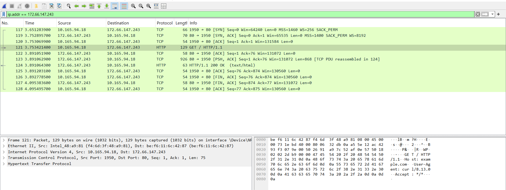
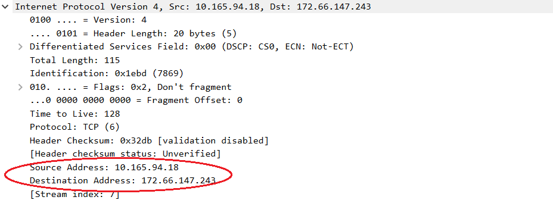
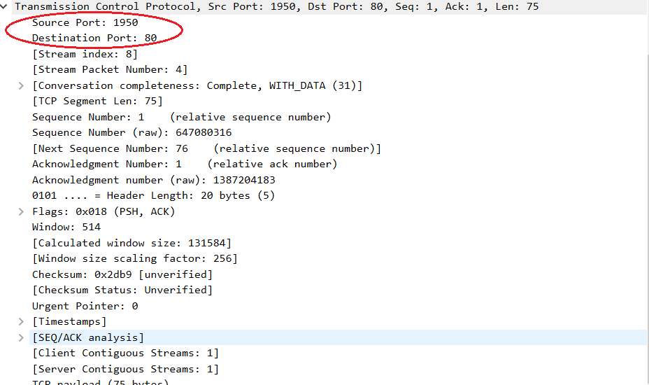
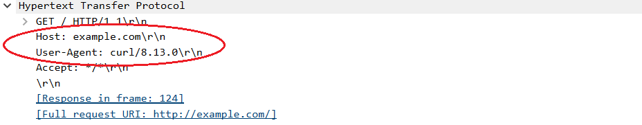

# پروژه شماره ۲ - تحلیل عمیق پروتکل‌های IP/TCP/HTTP

**دانشجو:** مریم کریمی
**شماره دانشجویی:** 40217023159

---

## فاز اول: راه‌اندازی محیط و شکار پکت‌ها

### ابزارهای استفاده‌شده
- Wireshark 
- curl در Command Prompt ویندوز

### شرح مراحل انجام‌شده

1. Wireshark نصب و اینترفیس **Wi-Fi** به‌عنوان اینترفیس فعال شبکه انتخاب و فرآیند Capture آغاز شد.

2. در ترمینال دستور زیر برای ارسال یک درخواست HTTP خام (بدون رمزنگاری TLS) اجرا شد:
```
curl http://example.com
```
> **نکته:** ابتدا از `neverssl.com` استفاده شد، اما به دلیل محدودیت دسترسی شبکه (بدون VPN)، درخواست با خطای Timeout مواجه شد. به همین دلیل، از دامنه‌ی جایگزین `example.com` استفاده شد که همانند `neverssl.com` بر پایه‌ی HTTP خام (بدون ریدایرکت به HTTPS) پاسخ می‌دهد.

3. پس از دریافت پاسخ کامل HTML در ترمینال، فرآیند Capture در Wireshark متوقف شد.

4. با فیلتر `ip.addr == 172.66.147.243`، چرخه‌ی کامل ارتباط شامل هندشیک سه‌طرفه TCP، درخواست HTTP، پاسخ سرور و بستن ارتباط (FIN/ACK) بررسی و صحت کپچر تأیید شد.

### اسکرین‌شات: نمای کلی کپچر



*شکل ۱: نمای کامل ترافیک TCP/HTTP بین سیستم (10.165.94.18) و سرور example.com (172.66.147.243) شامل هندشیک TCP، درخواست GET، پاسخ 200 OK و بستن ارتباط.*

### فایل ضمیمه
فایل کامل کپچر (بدون فیلتر اعمال‌شده) در مسیر زیر ذخیره شده است:
captures/phase1_capture.pcapng

---
---

## فاز دوم: کالبدشکافی هدرها و پشته پروتکلی

### فیلتر اعمال‌شده
```
http
```
[pase2](screenshots/phase2.png)
### پکت مورد بررسی
اولین بسته‌ی درخواست GET ارسالی به سرور: **پکت شماره ۱۲۱**

#### لایه ۳ - Network (IP)
| فیلد | مقدار |
|---|---|
| Source IP (سیستم من) | `10.165.94.18` |
| Destination IP (سرور) | `172.66.147.243` |



*شکل ۲: جزئیات لایه Network (IP) پکت GET؛ آدرس مبدأ و مقصد با کادر رنگی مشخص شده‌اند.*

#### لایه ۴ - Transport (TCP)
| فیلد | مقدار |
|---|---|
| Protocol | TCP |
| Source Port | `1950` |
| Destination Port | `80` |



*شکل ۳: جزئیات لایه Transport (TCP) پکت GET؛ پورت مبدأ و مقصد با کادر رنگی مشخص شده‌اند.*

#### لایه ۷ - Application (HTTP)
| فیلد | مقدار |
|---|---|
| Method | GET |
| Host | `example.com` |
| HTTP Version | HTTP/1.1 |
| User-Agent | `curl/8.13.0` |



*شکل ۴: جزئیات لایه Application (HTTP) پکت GET؛ Host و User-Agent با کادر رنگی مشخص شده‌اند.*

### توضیح تحلیلی
درخواست از پورت مبدأ `1950` (پورت موقت/Ephemeral که سیستم‌عامل به‌صورت تصادفی برای این اتصال اختصاص داده) به پورت مقصد `80` (پورت استاندارد HTTP) ارسال شده است. لایه انتقال از پروتکل **TCP** استفاده شده که یک پروتکل قابل‌اعتماد و connection-oriented است. اطلاعات پورت مبدأ و مقصد مستقیماً از هدر TCP موجود در پکت GET استخراج شده‌اند.

---